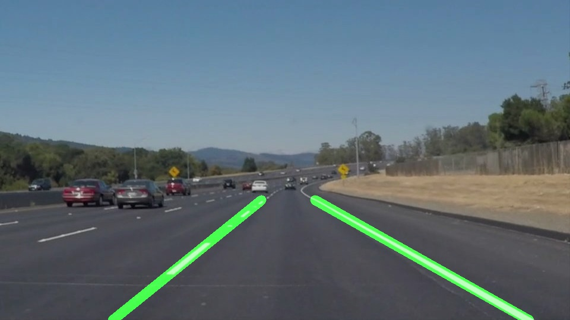

# **Writeup - Finding Lane Lines on the Road** 

**Finding Lane Lines on the Road**

The goals / steps of this project are the following:
* Make a pipeline that finds lane lines on the road
* Reflect on your work in a written report

---

### Reflection

### 1. Description of Pipeline

The line finding pipeline created in this project was based on the methods tought in the accompanying lesson. An image passing through the pipeline is first converted into grayscale which means the edge detection algorithm would later look for edges in light intensity. Then the image is low pass filtered with Gaussian blur in order to remove what we can consider as high frequency noise in the image compared to the lane lines. 

The color conversion and blurring could be considered pre processing steps to the edge detection algorithm. The Canny edge detection algorithm was used which looks at the gradient of the image and keeps values which are above a high threshold or which are above a low threshold and are connected to edges above the high threshold. The output is an image where detected edges are white and everything else is black.

The next step in the pipeline is to apply a mask of the region of interest in the image. Here it is assumed that road and lines we are looking for are withing a 4 edge polygon on the lower half of the image. 

After the area of interest has been masked out, a transform converting the image into a hough space for straight lines in polar coordinates is applied. The Hough line algorithm returns a list of start and end points which represent straight lines of sufficient length found in the Canny edge image.

In order to filter out horizontal lines and lines which are unlikely to be the lane lines, the lines are filtered based on their slope. This is also how lines within the left and right lane lines are separated from eachother. The difference in slope comes from view perspective and the fact that the camera is in between the lines.

When the line segments have been sorted into left and right lane lines the center point of each is calculated as the average coordinate of all start and end points. After this the average slope of each side is calculated. The long lines are computed using the straight line equation from the center point to fixed y-coordinates, one for the bottom of the image and one for the horizon. A first order filter is used for the slope between frames to get a slightly smoother movement of the lines.

An example of the final output is shown in the figure below.

### 2. Shortcomings
The current algorithm is not very general for different camera positions, aspect ratios, light conditions, road appearences, road construction work etc. It also makes many assumptions on where the road lines should be found in the image and how they should look, which means it is mostly useful to confirm that we are within a known situation, and possivbly to control the lateral position of the car in some standard scenarios.

### 3. Future Work
One choice made was to compute the average slope of all lines detected for the left and right sides. This average slope was fairly noisy and a better way to find the most "correct" slope could be to use a least squares solution, perhaps using points sampled from the detected lines to make long lines have a larger say than the shorter ones.

One could also look at tracking the lines in a different way than assuming they will have a certain slope (left line slopes right, right line slopes left) and instead find lines with any slope. Then the algorithm would be able to track the lines as we are changing lanes etc.

Some more work to generalize to different camera resolutions and aspect ratios would also be good. 